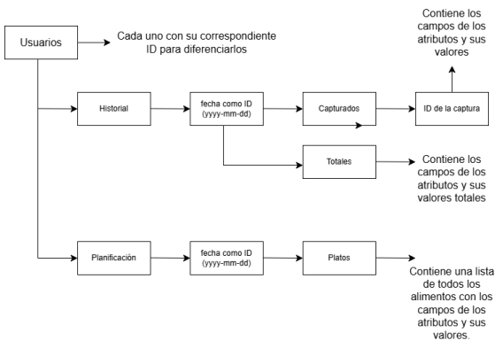
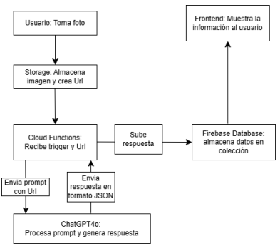
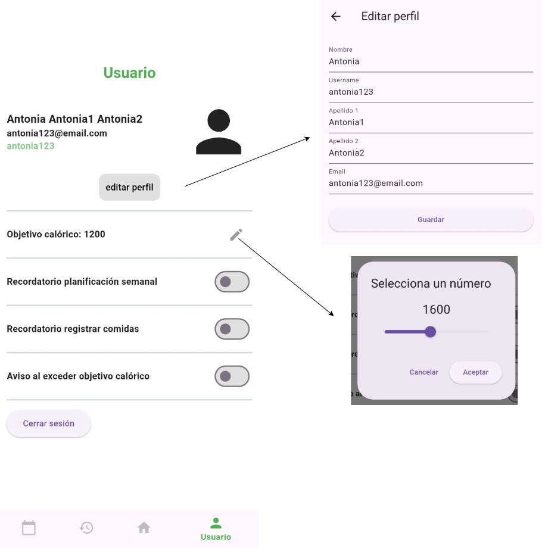
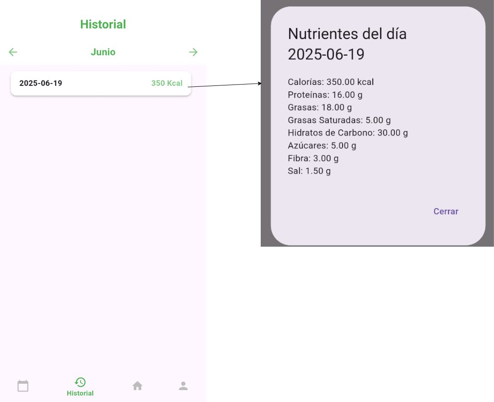
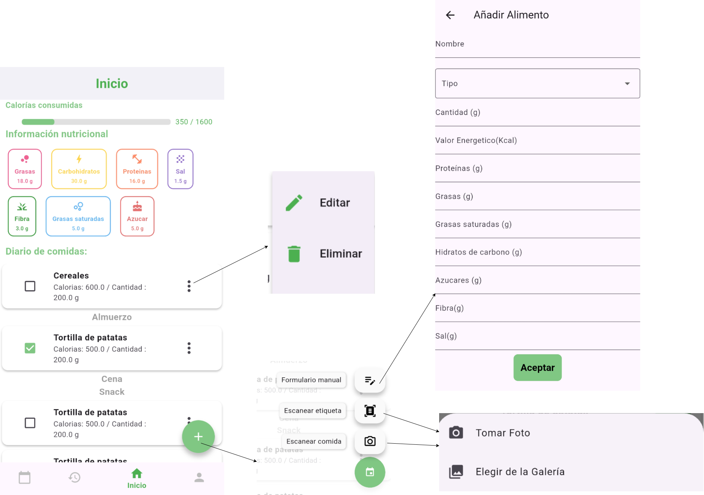
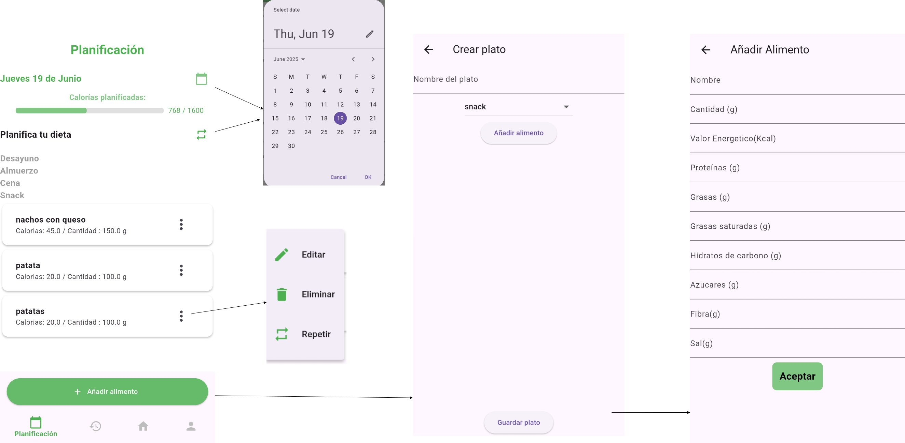

# App móvil para el reconocimiento y gestión de información nutricional a partir de etiquetas de productos

Aplicación móvil con integración de IA desarrollada como Trabajo de Fin de Grado.

## Technologies used

{width=50px} {width=50px} {width=50px} {width=50px} {width=50px} {width=50px}

## Overview

Desarrollo de una aplicación móvil que permite a los usuarios capturar imágenes de alimentos y etiquetas nutricionales para extraer automáticamente información clave como calorías, proteínas, azúcares y más. La aplicación utiliza inteligencia artificial para el reconocimiento de texto. El objetivo principal es automatizar el seguimiento nutricional diario de los usuarios, ofreciendo una experiencia intuitiva, rápida y precisa.

## Base de datos

{width=600px}

## Diagrama implementación IA

{width=600px}

## Pantallas

* **Usuario:**

{width=700px}

* **Historial:**
  
{width=700px}

* **Home:**

{width=700px}

* **Planificación:**

{width=700px}

## Features

* Integración con OpenAI API
* Sistema de autenticación
* Historial de interacciones
* Sistema de planificación
* Lectura automática de nutrientes

## Academic Context

Proyecto desarrollado como Trabajo de Fin de Grado para [Universidad Politecnica de Cataluña].

## Documentación oficial

* [UPC Link(Oficial Documentation)](https://hdl.handle.net/2117/450754)
* [Presentation (PDF)](ReadmeFiles/DefensaTFG.pdf)

## Current Status

Proyecto finalizado como prototipo académico.

Algunas áreas del código reflejan decisiones tempranas de aprendizaje
y no representan necesariamente prácticas de producción actuales.

## What I Learned

* Integración de IA en aplicaciones móviles
* Gestión de APIs y asincronía
* Diseño de flujos conversacionales
* Organización de aplicaciones mobile
* Gestión de estado y navegación
* Organización de Base de datos NoSQL
* Diseño UI/UX

## Security Note

Las credenciales originales(Open AI) utilizadas durante el desarrollo académico fueron revocadas y eliminadas antes de publicar este repositorio.

## License

All rights reserved.

This repository is publicly visible for educational and portfolio purposes only.

Copyright (c) 2026 Tu Nombre

All rights reserved.

This repository is publicly available for educational and portfolio purposes only.

No permission is granted to reuse, redistribute, modify, or commercially exploit any part of this project without explicit permission from the author.

Some academic materials may also be subject to institutional rights or third-party licenses.
